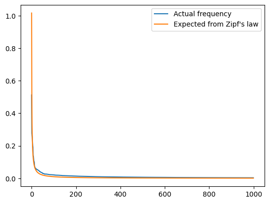
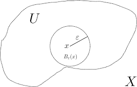
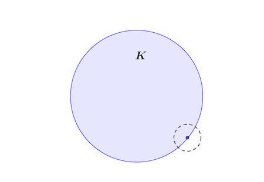

# Wikipedia Search Engine

## Authors:
- [Krzysztof Skrobała](https://github.com/shhhQuiettt)
- [Wojciech Bogacz](https://github.com/wojbog)

 
The aim of this project is to index the Wikipedia and build a **recommender system** in a simplified form on top of it.
Given a list of previously read articles, the system should recommend the next article to read.

In this simplified form we assume that the documents are related, for example that they come from a **single session**, and we want to recommend the next article(s) to read.

### Process consists of following steps:

1. **Building the database**

   1. Downloading the Wikipedia dump
   2. Text Preprocessing
   3. Indexing
   4. Storing the index

2. **Recommending**
   1. Querying the read documents
   2. Calculating similarities
   3. Recommending the k-next articles

## Usage

- **1. Cloning the repository**

```
git clone --depth 1 https://github.com/shhhQuiettt/wikipedia-search-engine.git
cd wikipedia-search-engine

```

- **2. Creating virtual environment and downloading necessary packages**

```
python -m venv .venv
source .venv/bin/activate
pip install -r requirements.txt
```

- **2. Building the database**

Run this command to start the crawling and database building process:

```
python build_db.py
```

- **3. Recommending**

Put visited links inside `previously_seen.txt` and run this command to get 5 recommendations:

```
python recommender.py 5 previously_seen.txt
```

# Implementation

## Building the database

The building and indexing is done **asynchronously**. The crawling process is implemented in a coroutine model on a one thread ([`crawler.py`](https://github.com/shhhQuiettt/wikipedia-search-engine/blob/main/crawler.py)), while the indexing is done in a separate thread with multiple workers ([`indexing.py`](https://github.com/shhhQuiettt/wikipedia-search-engine/blob/main/indexing.py)).

### Downloading the Wikipedia dump

The crawler start from **three initial urls** to:

- An _important_ mathematical theorem: [Hairy Ball Theorem](https://en.wikipedia.org/wiki/Hairy_ball_theorem)
- Butterjelly sandwich: [Butterjelly sandwich](https://en.wikipedia.org/wiki/Butterjelly_sandwich)
- Hedgehog: [Hedgehog](https://en.wikipedia.org/wiki/Hedgehog)

Then `BeautifulSoup` is used to parse the html and extract the text from the body of the document. We also extract the title of the document. The document gets inside a queue, where it will await **preprocessing and indexing**, and we search for all urls in the body to apply the procedure recursively.

### Text Preprocessing

The text is preprocessed in the following way:

1. **Tokenization**

We tokenize the text using `nltk`'s `word_tokenize` function to obtain a list of tokens.

2. **Lemmatization**

We lemmatize the tokens using `nltk`'s `WordNetLemmatizer` to extract the base word of the token.
For example the word "running" will be lemmatized to "run".

3. **Stopwords removal**

We remove the stopwords using `nltk`'s `stopwords` list.

### Indexing

We want to store **TF-IDF** values for each word in document:

$$ \text{TF}(\text{term}, \text{document}) = \frac{\text{number of term appears in document}}{\text{number of the most frequent term in document}} $$

$$ \text{IDF}(\text{term}) = \log \left( \frac{\text{total number of documents}}{\text{number of documents containing term}} \right) $$

$$ \text{TF-IDF}(\text{term}, \text{document}) = \text{TF}(\text{term}, \text{document}) \times \text{IDF}(\text{term}) $$

The **IDF** is important in order to prioritize terms with **high entropy** among other documents

### Storing the index

In the current implementation we store inverted index inside **sqlite** database, but we abstract the index storage to an _abstract class_ `InvertedIndex` to possibly test other storage methods like **NoSQL** databases like _mongoDB_ or **RAM-base** like _Redis_

# Recommending

The read documents are queried from the database and the similarities are calculated using the **cosine similarity**. The cosine similarity is calculated as follows:

$$ \text{cosine similarity}(\text{doc1}, \text{doc2}) = \frac{\text{doc1} \cdot \text{doc2}}{\| \text{doc1} \| \times \| \text{doc2} \|} $$

Where document vector is a vector of **TF-IDF** values for each word in the document.

The implementation allows for using other similarity measures which fulfill the `similarity_function` interface (`recommender.py`), so we also tested **Jaccard similarity** with binary vectors:

$$ \text{Jaccard similarity}(\text{doc1}, \text{doc2}) = \frac{\text{doc1} \cap \text{doc2}}{\text{doc1} \cup \text{doc2}} $$

In the currenct implementation we assume that the documents come from a **single session** and we want to recommend the next `k` article(s) to read.

We calculate the **centroid** of the read documents and recommend the `k` closest documents to the centroid.

<section id="some-recommendations" class="cell markdown">
<h1>Some recommendations</h1>
</section>
<section
id="1-this-session-relates-to-mathematitics-and-pioneers-of-calculus"
class="cell markdown">
<h3>1. This session relates to <strong>Mathematitics</strong> and
pioneers of <strong>Calculus</strong></h3>
</section>
<div class="cell code" data-execution_count="1">
<div class="sourceCode" id="cb1"><pre
class="sourceCode python"><code class="sourceCode python"><span id="cb1-1"><a href="#cb1-1" aria-hidden="true" tabindex="-1"></a><span class="op">!</span>cat .<span class="op">/</span>example_visited<span class="op">/</span>previously_seen1.txt</span></code></pre></div>
<div class="output stream stdout">
<pre><code>https://en.wikipedia.org/wiki/Leonhard_Euler
https://en.wikipedia.org/wiki/Isaac_Newton
https://en.wikipedia.org/wiki/Mathematics
https://en.wikipedia.org/wiki/Functions_(mathematics)
https://en.wikipedia.org/wiki/Real_number


</code></pre>
</div>
</div>
<div class="cell code" data-execution_count="2">
<div class="sourceCode" id="cb3"><pre
class="sourceCode python"><code class="sourceCode python"><span id="cb3-1"><a href="#cb3-1" aria-hidden="true" tabindex="-1"></a><span class="op">!</span>python recommender.py <span class="dv">5</span> .<span class="op">/</span>example_visited<span class="op">/</span>previously_seen1.txt</span></code></pre></div>
<div class="output stream stdout">
<pre><code>https://en.wikipedia.org/wiki/Leonhard_Euler not found in the database. Calculating document vector...
https://en.wikipedia.org/wiki/Isaac_Newton not found in the database. Calculating document vector...
Recommended documents:
(240, &#39;https://en.wikipedia.org/wiki/Hyperreal_numbers&#39;, &#39;Hyperreal number&#39;)
Cosine similarity: 0.06210137608606608

(258, &#39;https://en.wikipedia.org/wiki/Theorem&#39;, &#39;Theorem&#39;)
Cosine similarity: 0.0590626066522234

(79, &#39;https://en.wikipedia.org/wiki/Calculus&#39;, &#39;Calculus&#39;)
Cosine similarity: 0.054672164284898996

(322, &#39;https://en.wikipedia.org/wiki/Bijective&#39;, &#39;Bijection&#39;)
Cosine similarity: 0.05021229255088811

(184, &#39;https://en.wikipedia.org/wiki/Mathematical_analysis&#39;, &#39;Mathematical analysis&#39;)
Cosine similarity: 0.04862576791724621

</code></pre>
</div>
</div>
<div class="cell markdown">
<p>We see topics we would expect for someone interested in
<strong>Newton</strong> and <strong>Euler</strong> and
<strong>Mathematics</strong></p>
</div>
<section id="2-this-session-relates-sandwiches" class="cell markdown">
<h3>2. This session relates sandwiches</h3>
</section>
<div class="cell code" data-execution_count="3">
<div class="sourceCode" id="cb5"><pre
class="sourceCode python"><code class="sourceCode python"><span id="cb5-1"><a href="#cb5-1" aria-hidden="true" tabindex="-1"></a><span class="op">!</span>cat .<span class="op">/</span>example_visited<span class="op">/</span>previously_seen2.txt</span></code></pre></div>
<div class="output stream stdout">
<pre><code>https://en.wikipedia.org/wiki/Peanut_butter
https://en.wikipedia.org/wiki/Lunch
https://en.wikipedia.org/wiki/Sandwich
</code></pre>
</div>
</div>
<div class="cell code" data-execution_count="4">
<div class="sourceCode" id="cb7"><pre
class="sourceCode python"><code class="sourceCode python"><span id="cb7-1"><a href="#cb7-1" aria-hidden="true" tabindex="-1"></a><span class="op">!</span>python recommender.py <span class="dv">5</span> .<span class="op">/</span>example_visited<span class="op">/</span>previously_seen2.txt</span></code></pre></div>
<div class="output stream stdout">
<pre><code>Recommended documents:
(560, &#39;https://en.wikipedia.org/wiki/Bal%C4%B1k_ekmek&#39;, &#39;Balık ekmek&#39;)
Cosine similarity: 0.23502137689424202

(605, &#39;https://en.wikipedia.org/wiki/Roujiamo&#39;, &#39;Roujiamo&#39;)
Cosine similarity: 0.20909613026041712

(599, &#39;https://en.wikipedia.org/wiki/Panini_(sandwich)&#39;, &#39;Panini (sandwich)&#39;)
Cosine similarity: 0.19268899828898028

(583, &#39;https://en.wikipedia.org/wiki/Donkey_burger&#39;, &#39;Donkey burger&#39;)
Cosine similarity: 0.19119226566432948

(800, &#39;https://en.wikipedia.org/wiki/Bag_lunch&#39;, &#39;Packed lunch&#39;)
Cosine similarity: 0.18548005955094318

</code></pre>
</div>
</div>
<div class="cell markdown">
<p>Indeed, we see different types of sandwiches someone could be
interested in</p>
</div>
<section id="some-statistics-and-exploration-of-the-results"
class="cell markdown" data-jukit_cell_id="5tJdZ3c28b">
<h1>Some statistics and exploration of the results</h1>
</section>
<div class="cell code" data-execution_count="5"
data-jukit_cell_id="BKwtjaM3EH">
<div class="sourceCode" id="cb9"><pre
class="sourceCode python"><code class="sourceCode python"><span id="cb9-1"><a href="#cb9-1" aria-hidden="true" tabindex="-1"></a><span class="im">import</span> matplotlib.pyplot <span class="im">as</span> plt</span>
<span id="cb9-2"><a href="#cb9-2" aria-hidden="true" tabindex="-1"></a><span class="im">from</span> indexing <span class="im">import</span> SqliteInvertedIndex</span>
<span id="cb9-3"><a href="#cb9-3" aria-hidden="true" tabindex="-1"></a><span class="im">import</span> recommender</span>
<span id="cb9-4"><a href="#cb9-4" aria-hidden="true" tabindex="-1"></a><span class="im">from</span> recommender <span class="im">import</span> jacard_similarity, cosine_similarity</span>
<span id="cb9-5"><a href="#cb9-5" aria-hidden="true" tabindex="-1"></a><span class="im">import</span> numpy <span class="im">as</span> np</span></code></pre></div>
</div>
<div class="cell code" data-execution_count="6"
data-jukit_cell_id="acP0eTQMOW">
<div class="sourceCode" id="cb10"><pre
class="sourceCode python"><code class="sourceCode python"><span id="cb10-1"><a href="#cb10-1" aria-hidden="true" tabindex="-1"></a>inverted_index <span class="op">=</span> SqliteInvertedIndex(<span class="st">&quot;inverted_index.db&quot;</span>)</span>
<span id="cb10-2"><a href="#cb10-2" aria-hidden="true" tabindex="-1"></a>inverted_index_matrix <span class="op">=</span> inverted_index.get_tf_idf_matrix()</span>
<span id="cb10-3"><a href="#cb10-3" aria-hidden="true" tabindex="-1"></a></span>
<span id="cb10-4"><a href="#cb10-4" aria-hidden="true" tabindex="-1"></a>query <span class="op">=</span> <span class="kw">lambda</span> query_text: inverted_index.cursor.execute(query_text)</span></code></pre></div>
</div>
<section id="number-of-documents" class="cell markdown"
data-jukit_cell_id="mzdCRVc0zz">
<h2>Number of documents</h2>
</section>
<div class="cell code" data-execution_count="7"
data-jukit_cell_id="88v3KdgHkG">
<div class="sourceCode" id="cb11"><pre
class="sourceCode python"><code class="sourceCode python"><span id="cb11-1"><a href="#cb11-1" aria-hidden="true" tabindex="-1"></a>query(<span class="st">&quot;select count(*) from documents&quot;</span>).fetchone()</span></code></pre></div>
<div class="output execute_result" data-execution_count="7">
<pre><code>(1000,)</code></pre>
</div>
</div>
<section id="number-of-terms" class="cell markdown"
data-jukit_cell_id="OF5gpUBFki">
<h3>Number of terms</h3>
</section>
<div class="cell code" data-execution_count="8"
data-jukit_cell_id="tlDonAt6DD">
<div class="sourceCode" id="cb13"><pre
class="sourceCode python"><code class="sourceCode python"><span id="cb13-1"><a href="#cb13-1" aria-hidden="true" tabindex="-1"></a>query(<span class="st">&quot;select count(*) from terms&quot;</span>).fetchone()</span></code></pre></div>
<div class="output execute_result" data-execution_count="8">
<pre><code>(116470,)</code></pre>
</div>
</div>
<section id="top-20-frequently-occuring-terms" class="cell markdown"
data-jukit_cell_id="uDkOPumtEj">
<h3>Top 20 frequently occuring terms</h3>
</section>
<div class="cell code" data-execution_count="9"
data-jukit_cell_id="bq6KyOhPAv">
<div class="sourceCode" id="cb15"><pre
class="sourceCode python"><code class="sourceCode python"><span id="cb15-1"><a href="#cb15-1" aria-hidden="true" tabindex="-1"></a>res <span class="op">=</span> query(</span>
<span id="cb15-2"><a href="#cb15-2" aria-hidden="true" tabindex="-1"></a>    <span class="st">&quot;&quot;&quot;</span></span>
<span id="cb15-3"><a href="#cb15-3" aria-hidden="true" tabindex="-1"></a><span class="st">    select term, sum(count) </span></span>
<span id="cb15-4"><a href="#cb15-4" aria-hidden="true" tabindex="-1"></a><span class="st">    from postings p </span></span>
<span id="cb15-5"><a href="#cb15-5" aria-hidden="true" tabindex="-1"></a><span class="st">    join terms t on p.term_id = t.id </span></span>
<span id="cb15-6"><a href="#cb15-6" aria-hidden="true" tabindex="-1"></a><span class="st">    group by term </span></span>
<span id="cb15-7"><a href="#cb15-7" aria-hidden="true" tabindex="-1"></a><span class="st">    having length(term) &gt; 3 </span></span>
<span id="cb15-8"><a href="#cb15-8" aria-hidden="true" tabindex="-1"></a><span class="st">    order by sum(count) desc</span></span>
<span id="cb15-9"><a href="#cb15-9" aria-hidden="true" tabindex="-1"></a><span class="st">    limit 10</span></span>
<span id="cb15-10"><a href="#cb15-10" aria-hidden="true" tabindex="-1"></a><span class="st">            &quot;&quot;&quot;</span></span>
<span id="cb15-11"><a href="#cb15-11" aria-hidden="true" tabindex="-1"></a>)</span>
<span id="cb15-12"><a href="#cb15-12" aria-hidden="true" tabindex="-1"></a>res.fetchall()</span></code></pre></div>
<div class="output execute_result" data-execution_count="9">
<pre><code>[(&#39;shrew&#39;, 32304),
 (&#39;function&#39;, 14177),
 (&#39;retrieved&#39;, 12128),
 (&#39;edit&#39;, 11623),
 (&#39;space&#39;, 8069),
 (&#39;isbn&#39;, 7562),
 (&#39;also&#39;, 7100),
 (&#39;archived&#39;, 6817),
 (&#39;original&#39;, 6753),
 (&#39;number&#39;, 6483)]</code></pre>
</div>
</div>
<div class="cell markdown" data-jukit_cell_id="29HOlidCNL">
<p>Despite weirdness of <em>shrew</em>, and manually checking, it turns
out that <em>shrew</em> <strong>indeed is</strong> a frequent word in
the documents related to mammals and other animals</p>
</div>
<section id="terms-with-lowest-entropy" class="cell markdown"
data-jukit_cell_id="YnwfvTmBYU">
<h3>Terms with lowest entropy</h3>
</section>
<div class="cell code" data-execution_count="10"
data-jukit_cell_id="7iVCUI0aWb">
<div class="sourceCode" id="cb17"><pre
class="sourceCode python"><code class="sourceCode python"><span id="cb17-1"><a href="#cb17-1" aria-hidden="true" tabindex="-1"></a>query(</span>
<span id="cb17-2"><a href="#cb17-2" aria-hidden="true" tabindex="-1"></a>    <span class="st">&quot;&quot;&quot;</span></span>
<span id="cb17-3"><a href="#cb17-3" aria-hidden="true" tabindex="-1"></a><span class="st">        select term, idf from terms order by idf asc limit 10</span></span>
<span id="cb17-4"><a href="#cb17-4" aria-hidden="true" tabindex="-1"></a><span class="st">        &quot;&quot;&quot;</span></span>
<span id="cb17-5"><a href="#cb17-5" aria-hidden="true" tabindex="-1"></a>).fetchall()</span></code></pre></div>
<div class="output execute_result" data-execution_count="10">
<pre><code>[(&#39;retrieved&#39;, 0.0),
 (&#39;http&#39;, 0.0),
 (&#39;1&#39;, 0.022245608947319737),
 (&#39;reference&#39;, 0.03978087001184446),
 (&#39;edit&#39;, 0.06935007813479324),
 (&#39;2&#39;, 0.08773891430800689),
 (&#39;also&#39;, 0.1266976530459575),
 (&#39;3&#39;, 0.1636960926707897),
 (&#39;see&#39;, 0.1779312084926618),
 (&#39;new&#39;, 0.18632957819149354)]</code></pre>
</div>
</div>
<section id="terms-with-highest-entropy" class="cell markdown"
data-jukit_cell_id="heVO1aiSno">
<h3>Terms with highest entropy</h3>
</section>
<div class="cell code" data-execution_count="11"
data-jukit_cell_id="2pSmidhWJs">
<div class="sourceCode" id="cb19"><pre
class="sourceCode python"><code class="sourceCode python"><span id="cb19-1"><a href="#cb19-1" aria-hidden="true" tabindex="-1"></a>query(</span>
<span id="cb19-2"><a href="#cb19-2" aria-hidden="true" tabindex="-1"></a>    <span class="st">&quot;&quot;&quot;</span></span>
<span id="cb19-3"><a href="#cb19-3" aria-hidden="true" tabindex="-1"></a><span class="st">  select term, idf from terms order by idf desc limit 10</span></span>
<span id="cb19-4"><a href="#cb19-4" aria-hidden="true" tabindex="-1"></a><span class="st">  &quot;&quot;&quot;</span></span>
<span id="cb19-5"><a href="#cb19-5" aria-hidden="true" tabindex="-1"></a>).fetchall()</span></code></pre></div>
<div class="output execute_result" data-execution_count="11">
<pre><code>[(&#39;combable&#39;, 6.907755278982137),
 (&#39;ℝ3&#39;, 6.907755278982137),
 (&#39;idealizes&#39;, 6.907755278982137),
 (&#39;meteorologically&#39;, 6.907755278982137),
 (&#39;accomplishes&#39;, 6.907755278982137),
 (&#39;gidea&#39;, 6.907755278982137),
 (&#39;1584882530&#39;, 6.907755278982137),
 (&#39;abbildung&#39;, 6.907755278982137),
 (&#39;bormashenko&#39;, 6.907755278982137),
 (&#39;kazachkov&#39;, 6.907755278982137)]</code></pre>
</div>
</div>
<section id="distribution-of-terms-occurance-among-all-documents"
class="cell markdown" data-jukit_cell_id="PBeq7ZpcIw">
<h3>Distribution of terms occurance among all documents</h3>
</section>
<div class="cell code" data-execution_count="12"
data-jukit_cell_id="VPxjM0s195">
<div class="sourceCode" id="cb21"><pre
class="sourceCode python"><code class="sourceCode python"><span id="cb21-1"><a href="#cb21-1" aria-hidden="true" tabindex="-1"></a>res <span class="op">=</span> query(</span>
<span id="cb21-2"><a href="#cb21-2" aria-hidden="true" tabindex="-1"></a>    <span class="st">&quot;&quot;&quot;</span></span>
<span id="cb21-3"><a href="#cb21-3" aria-hidden="true" tabindex="-1"></a><span class="st">        select t.term, sum(p.count) </span></span>
<span id="cb21-4"><a href="#cb21-4" aria-hidden="true" tabindex="-1"></a><span class="st">        from terms t join postings p on t.id = p.term_id </span></span>
<span id="cb21-5"><a href="#cb21-5" aria-hidden="true" tabindex="-1"></a><span class="st">        group by t.term</span></span>
<span id="cb21-6"><a href="#cb21-6" aria-hidden="true" tabindex="-1"></a><span class="st">        order by sum(p.count) desc</span></span>
<span id="cb21-7"><a href="#cb21-7" aria-hidden="true" tabindex="-1"></a><span class="st">    &quot;&quot;&quot;</span></span>
<span id="cb21-8"><a href="#cb21-8" aria-hidden="true" tabindex="-1"></a>).fetchall()</span>
<span id="cb21-9"><a href="#cb21-9" aria-hidden="true" tabindex="-1"></a></span>
<span id="cb21-10"><a href="#cb21-10" aria-hidden="true" tabindex="-1"></a>plt.plot([x[<span class="dv">1</span>] <span class="cf">for</span> x <span class="kw">in</span> res])</span></code></pre></div>
<div class="output execute_result" data-execution_count="12">
<pre><code>[&lt;matplotlib.lines.Line2D at 0x7ff29a850690&gt;]</code></pre>
</div>
<div class="output display_data">
<p></p>
</div>
</div>
<section id="checking-if-corpus-fulfills-zipfs-law"
class="cell markdown" data-jukit_cell_id="Mz3pWiVxLw">
<h3>Checking if corpus fulfills Zipf's law</h3>
</section>
<div class="cell code" data-execution_count="13"
data-jukit_cell_id="ZZsb7UgsYh">
<div class="sourceCode" id="cb23"><pre
class="sourceCode python"><code class="sourceCode python"><span id="cb23-1"><a href="#cb23-1" aria-hidden="true" tabindex="-1"></a>res <span class="op">=</span> query(</span>
<span id="cb23-2"><a href="#cb23-2" aria-hidden="true" tabindex="-1"></a>    <span class="st">&quot;&quot;&quot;</span></span>
<span id="cb23-3"><a href="#cb23-3" aria-hidden="true" tabindex="-1"></a><span class="st">    select t.term, sum(p.count)</span></span>
<span id="cb23-4"><a href="#cb23-4" aria-hidden="true" tabindex="-1"></a><span class="st">    from terms t join postings p on t.id = p.term_id</span></span>
<span id="cb23-5"><a href="#cb23-5" aria-hidden="true" tabindex="-1"></a><span class="st">    group by t.term</span></span>
<span id="cb23-6"><a href="#cb23-6" aria-hidden="true" tabindex="-1"></a><span class="st">    order by sum(p.count) desc</span></span>
<span id="cb23-7"><a href="#cb23-7" aria-hidden="true" tabindex="-1"></a><span class="st">    &quot;&quot;&quot;</span></span>
<span id="cb23-8"><a href="#cb23-8" aria-hidden="true" tabindex="-1"></a>).fetchall()</span>
<span id="cb23-9"><a href="#cb23-9" aria-hidden="true" tabindex="-1"></a></span>
<span id="cb23-10"><a href="#cb23-10" aria-hidden="true" tabindex="-1"></a>ocurrances <span class="op">=</span> np.array([x[<span class="dv">1</span>] <span class="cf">for</span> x <span class="kw">in</span> res])</span>
<span id="cb23-11"><a href="#cb23-11" aria-hidden="true" tabindex="-1"></a>N <span class="op">=</span> <span class="bu">len</span>(ocurrances)</span>
<span id="cb23-12"><a href="#cb23-12" aria-hidden="true" tabindex="-1"></a>k <span class="op">=</span> ocurrances[<span class="dv">3</span>] <span class="op">/</span> N <span class="op">*</span> <span class="dv">4</span></span>
<span id="cb23-13"><a href="#cb23-13" aria-hidden="true" tabindex="-1"></a>expected_zipf <span class="op">=</span> k <span class="op">/</span> np.arange(<span class="dv">1</span>, N <span class="op">+</span> <span class="dv">1</span>)</span>
<span id="cb23-14"><a href="#cb23-14" aria-hidden="true" tabindex="-1"></a></span>
<span id="cb23-15"><a href="#cb23-15" aria-hidden="true" tabindex="-1"></a>cut_off <span class="op">=</span> <span class="dv">1000</span></span>
<span id="cb23-16"><a href="#cb23-16" aria-hidden="true" tabindex="-1"></a>plt.plot(ocurrances[:<span class="dv">1000</span>] <span class="op">/</span> N)</span>
<span id="cb23-17"><a href="#cb23-17" aria-hidden="true" tabindex="-1"></a>plt.plot(expected_zipf[:<span class="dv">1000</span>])</span>
<span id="cb23-18"><a href="#cb23-18" aria-hidden="true" tabindex="-1"></a>plt.legend([<span class="st">&quot;Actual frequency&quot;</span>, <span class="st">&quot;Expected from Zipf&#39;s law&quot;</span>])</span></code></pre></div>
<div class="output execute_result" data-execution_count="13">
<pre><code>&lt;matplotlib.legend.Legend at 0x7ff29a84dbe0&gt;</code></pre>
</div>
<div class="output display_data">
<p></p>
</div>
</div>
<section id="documents-most-similar-to-the-article-open-set"
class="cell markdown" data-jukit_cell_id="yTfKqUqIFM">
<h3>Documents most similar to the article <strong>Open Set</strong></h3>
</section>
<div class="cell code" data-execution_count="14"
data-jukit_cell_id="oyxhg3nskT">
<div class="sourceCode" id="cb25"><pre
class="sourceCode python"><code class="sourceCode python"><span id="cb25-1"><a href="#cb25-1" aria-hidden="true" tabindex="-1"></a>url <span class="op">=</span> <span class="st">&quot;https://en.wikipedia.org/wiki/Open_set&quot;</span></span>
<span id="cb25-2"><a href="#cb25-2" aria-hidden="true" tabindex="-1"></a>doc_id <span class="op">=</span> inverted_index.get_document_id(url)</span>
<span id="cb25-3"><a href="#cb25-3" aria-hidden="true" tabindex="-1"></a><span class="cf">assert</span> doc_id <span class="kw">is</span> <span class="kw">not</span> <span class="va">None</span></span>
<span id="cb25-4"><a href="#cb25-4" aria-hidden="true" tabindex="-1"></a></span>
<span id="cb25-5"><a href="#cb25-5" aria-hidden="true" tabindex="-1"></a>doc_vector <span class="op">=</span> inverted_index_matrix[doc_id, :]</span>
<span id="cb25-6"><a href="#cb25-6" aria-hidden="true" tabindex="-1"></a></span>
<span id="cb25-7"><a href="#cb25-7" aria-hidden="true" tabindex="-1"></a>similarities <span class="op">=</span> np.apply_along_axis(</span>
<span id="cb25-8"><a href="#cb25-8" aria-hidden="true" tabindex="-1"></a>    <span class="kw">lambda</span> x: cosine_similarity(doc_vector, x), <span class="dv">1</span>, inverted_index_matrix</span>
<span id="cb25-9"><a href="#cb25-9" aria-hidden="true" tabindex="-1"></a>)</span>
<span id="cb25-10"><a href="#cb25-10" aria-hidden="true" tabindex="-1"></a></span>
<span id="cb25-11"><a href="#cb25-11" aria-hidden="true" tabindex="-1"></a>top_5_similarities <span class="op">=</span> np.argsort(similarities, axis<span class="op">=</span><span class="dv">0</span>)[<span class="op">-</span><span class="dv">6</span>:<span class="op">-</span><span class="dv">1</span>]</span>
<span id="cb25-12"><a href="#cb25-12" aria-hidden="true" tabindex="-1"></a></span>
<span id="cb25-13"><a href="#cb25-13" aria-hidden="true" tabindex="-1"></a><span class="cf">for</span> doc_id <span class="kw">in</span> top_5_similarities[::<span class="op">-</span><span class="dv">1</span>]:</span>
<span id="cb25-14"><a href="#cb25-14" aria-hidden="true" tabindex="-1"></a>    res <span class="op">=</span> query(</span>
<span id="cb25-15"><a href="#cb25-15" aria-hidden="true" tabindex="-1"></a>        <span class="ss">f&quot;&quot;&quot;</span></span>
<span id="cb25-16"><a href="#cb25-16" aria-hidden="true" tabindex="-1"></a><span class="ss">        select title from documents where id = </span><span class="sc">{</span>doc_id<span class="sc">}</span></span>
<span id="cb25-17"><a href="#cb25-17" aria-hidden="true" tabindex="-1"></a><span class="ss">        &quot;&quot;&quot;</span>,</span>
<span id="cb25-18"><a href="#cb25-18" aria-hidden="true" tabindex="-1"></a>    ).fetchone()</span>
<span id="cb25-19"><a href="#cb25-19" aria-hidden="true" tabindex="-1"></a>    <span class="cf">assert</span> res <span class="kw">is</span> <span class="kw">not</span> <span class="va">None</span></span>
<span id="cb25-20"><a href="#cb25-20" aria-hidden="true" tabindex="-1"></a>    <span class="bu">print</span>(<span class="ss">f&quot;Title: </span><span class="sc">{</span>res[<span class="dv">0</span>]<span class="sc">}</span><span class="ss">&quot;</span>)</span>
<span id="cb25-21"><a href="#cb25-21" aria-hidden="true" tabindex="-1"></a>    <span class="bu">print</span>(<span class="ss">f&quot;Cosine similarity: </span><span class="sc">{</span>similarities[doc_id]<span class="sc">}</span><span class="ch">\n</span><span class="ss">&quot;</span>)</span></code></pre></div>
<div class="output stream stdout">
<pre><code>Title: Open set
Cosine similarity: 1.0

Title: Closed set
Cosine similarity: 0.1670939050012435

Title: Accumulation point
Cosine similarity: 0.09399570728349808

Title: Open and closed maps
Cosine similarity: 0.09323925622985396

Title: Open and closed maps
Cosine similarity: 0.09323925622985396

</code></pre>
</div>
</div>
<section id="documents-least-similar-document-to-the-article-open-set"
class="cell markdown" data-jukit_cell_id="tfegEl31Qc">
<h3>Documents least similar document to the article <strong>Open
set</strong></h3>
</section>
<div class="cell code" data-execution_count="15"
data-jukit_cell_id="8LPlMdFam6">
<div class="sourceCode" id="cb27"><pre
class="sourceCode python"><code class="sourceCode python"><span id="cb27-1"><a href="#cb27-1" aria-hidden="true" tabindex="-1"></a>url <span class="op">=</span> <span class="st">&quot;https://en.wikipedia.org/wiki/Open_set&quot;</span></span>
<span id="cb27-2"><a href="#cb27-2" aria-hidden="true" tabindex="-1"></a>doc_id <span class="op">=</span> inverted_index.get_document_id(url)</span>
<span id="cb27-3"><a href="#cb27-3" aria-hidden="true" tabindex="-1"></a><span class="cf">assert</span> doc_id <span class="kw">is</span> <span class="kw">not</span> <span class="va">None</span></span>
<span id="cb27-4"><a href="#cb27-4" aria-hidden="true" tabindex="-1"></a></span>
<span id="cb27-5"><a href="#cb27-5" aria-hidden="true" tabindex="-1"></a>doc_vector <span class="op">=</span> inverted_index_matrix[doc_id, :]</span>
<span id="cb27-6"><a href="#cb27-6" aria-hidden="true" tabindex="-1"></a></span>
<span id="cb27-7"><a href="#cb27-7" aria-hidden="true" tabindex="-1"></a>similarities <span class="op">=</span> np.apply_along_axis(</span>
<span id="cb27-8"><a href="#cb27-8" aria-hidden="true" tabindex="-1"></a>    <span class="kw">lambda</span> x: cosine_similarity(doc_vector, x), <span class="dv">1</span>, inverted_index_matrix</span>
<span id="cb27-9"><a href="#cb27-9" aria-hidden="true" tabindex="-1"></a>)</span>
<span id="cb27-10"><a href="#cb27-10" aria-hidden="true" tabindex="-1"></a></span>
<span id="cb27-11"><a href="#cb27-11" aria-hidden="true" tabindex="-1"></a>top_5_similarities <span class="op">=</span> np.argsort(similarities, axis<span class="op">=</span><span class="dv">0</span>)[:<span class="dv">5</span>]</span>
<span id="cb27-12"><a href="#cb27-12" aria-hidden="true" tabindex="-1"></a></span>
<span id="cb27-13"><a href="#cb27-13" aria-hidden="true" tabindex="-1"></a><span class="cf">for</span> doc_id <span class="kw">in</span> top_5_similarities:</span>
<span id="cb27-14"><a href="#cb27-14" aria-hidden="true" tabindex="-1"></a>    res <span class="op">=</span> query(</span>
<span id="cb27-15"><a href="#cb27-15" aria-hidden="true" tabindex="-1"></a>        <span class="ss">f&quot;&quot;&quot;</span></span>
<span id="cb27-16"><a href="#cb27-16" aria-hidden="true" tabindex="-1"></a><span class="ss">        select title from documents where id = </span><span class="sc">{</span>doc_id<span class="sc">}</span></span>
<span id="cb27-17"><a href="#cb27-17" aria-hidden="true" tabindex="-1"></a><span class="ss">        &quot;&quot;&quot;</span>,</span>
<span id="cb27-18"><a href="#cb27-18" aria-hidden="true" tabindex="-1"></a>    ).fetchone()</span>
<span id="cb27-19"><a href="#cb27-19" aria-hidden="true" tabindex="-1"></a>    <span class="cf">assert</span> res <span class="kw">is</span> <span class="kw">not</span> <span class="va">None</span></span>
<span id="cb27-20"><a href="#cb27-20" aria-hidden="true" tabindex="-1"></a>    <span class="bu">print</span>(<span class="ss">f&quot;Title: </span><span class="sc">{</span>res[<span class="dv">0</span>]<span class="sc">}</span><span class="ss">&quot;</span>)</span>
<span id="cb27-21"><a href="#cb27-21" aria-hidden="true" tabindex="-1"></a>    <span class="bu">print</span>(<span class="ss">f&quot;Cosine similarity: </span><span class="sc">{</span>similarities[doc_id]<span class="sc">}</span><span class="ch">\n</span><span class="ss">&quot;</span>)</span></code></pre></div>
<div class="output stream stdout">
<pre><code>Title: Eastern forest hedgehog
Cosine similarity: 4.099291536117715e-06

Title: Chacarero
Cosine similarity: 1.473436229790874e-05

Title: Somali hedgehog
Cosine similarity: 2.148079406048971e-05

Title: Hemiechinus
Cosine similarity: 2.2237134281189762e-05

Title: Gaoligong forest hedgehog
Cosine similarity: 2.259060627956648e-05

</code></pre>
</div>
</div>
<div class="cell markdown" data-jukit_cell_id="5qQpK8dZFl">
<p>These results make sense, as Open Set relates to topics like
<em>topology</em> and <em>closed sets</em>, while do not relate to
topics like <em>hedgehogs</em> or <em>Chacarero</em></p>
<p><strong>Open Set</strong>:</p>
<p></p>
<p><strong>Closed Set</strong> (similar to Open Set):</p>
<p></p>
<p><strong>Eastern forest hedgehog</strong> (not similar to Open
Set):</p>
<p></p>
</div>
<section id="comparing-similiarities-between-various-documents"
class="cell markdown" data-jukit_cell_id="DUKR4HkT1D">
<h1>Comparing similiarities between various documents</h1>
</section>
<div class="cell code" data-execution_count="16"
data-jukit_cell_id="O3AiHggqL4">
<div class="sourceCode" id="cb29"><pre
class="sourceCode python"><code class="sourceCode python"><span id="cb29-1"><a href="#cb29-1" aria-hidden="true" tabindex="-1"></a>hedghog_doc_url <span class="op">=</span> <span class="st">&quot;https://en.wikipedia.org/wiki/Hedgehog&quot;</span></span>
<span id="cb29-2"><a href="#cb29-2" aria-hidden="true" tabindex="-1"></a>hedgehog_doc_id <span class="op">=</span> inverted_index.get_document_id(hedghog_doc_url)</span>
<span id="cb29-3"><a href="#cb29-3" aria-hidden="true" tabindex="-1"></a>hedgehog_doc_vector <span class="op">=</span> inverted_index_matrix[hedgehog_doc_id, :]</span>
<span id="cb29-4"><a href="#cb29-4" aria-hidden="true" tabindex="-1"></a><span class="cf">assert</span> hedgehog_doc_vector <span class="kw">is</span> <span class="kw">not</span> <span class="va">None</span></span>
<span id="cb29-5"><a href="#cb29-5" aria-hidden="true" tabindex="-1"></a></span>
<span id="cb29-6"><a href="#cb29-6" aria-hidden="true" tabindex="-1"></a>calculus_doc_url <span class="op">=</span> <span class="st">&quot;https://en.wikipedia.org/wiki/Calculus&quot;</span></span>
<span id="cb29-7"><a href="#cb29-7" aria-hidden="true" tabindex="-1"></a>calculus_doc_id <span class="op">=</span> inverted_index.get_document_id(calculus_doc_url)</span>
<span id="cb29-8"><a href="#cb29-8" aria-hidden="true" tabindex="-1"></a>calculus_doc_vector <span class="op">=</span> inverted_index_matrix[calculus_doc_id, :]</span>
<span id="cb29-9"><a href="#cb29-9" aria-hidden="true" tabindex="-1"></a><span class="cf">assert</span> calculus_doc_vector <span class="kw">is</span> <span class="kw">not</span> <span class="va">None</span></span>
<span id="cb29-10"><a href="#cb29-10" aria-hidden="true" tabindex="-1"></a></span>
<span id="cb29-11"><a href="#cb29-11" aria-hidden="true" tabindex="-1"></a>derivatives_doc_url <span class="op">=</span> <span class="st">&quot;https://en.wikipedia.org/wiki/Derivative&quot;</span></span>
<span id="cb29-12"><a href="#cb29-12" aria-hidden="true" tabindex="-1"></a>derivatives_doc_id <span class="op">=</span> inverted_index.get_document_id(derivatives_doc_url)</span>
<span id="cb29-13"><a href="#cb29-13" aria-hidden="true" tabindex="-1"></a>derivatives_doc_vector <span class="op">=</span> inverted_index_matrix[derivatives_doc_id, :]</span>
<span id="cb29-14"><a href="#cb29-14" aria-hidden="true" tabindex="-1"></a><span class="cf">assert</span> derivatives_doc_vector <span class="kw">is</span> <span class="kw">not</span> <span class="va">None</span></span></code></pre></div>
</div>
<section
id="cosine-similarity-and-jacard-similarity-between-hedgehog-and-calculus"
class="cell markdown" data-jukit_cell_id="OJJuEbgXHQ">
<h3>Cosine similarity and Jacard similarity between hedgehog and
calculus</h3>
</section>
<div class="cell code" data-execution_count="17"
data-jukit_cell_id="PASWx1dFOx">
<div class="sourceCode" id="cb30"><pre
class="sourceCode python"><code class="sourceCode python"><span id="cb30-1"><a href="#cb30-1" aria-hidden="true" tabindex="-1"></a>cosine_similarity_score <span class="op">=</span> cosine_similarity(hedgehog_doc_vector, calculus_doc_vector)</span>
<span id="cb30-2"><a href="#cb30-2" aria-hidden="true" tabindex="-1"></a>jacard_similarity_score <span class="op">=</span> jacard_similarity(hedgehog_doc_vector, calculus_doc_vector)</span>
<span id="cb30-3"><a href="#cb30-3" aria-hidden="true" tabindex="-1"></a></span>
<span id="cb30-4"><a href="#cb30-4" aria-hidden="true" tabindex="-1"></a><span class="bu">print</span>(<span class="st">&quot;Hedgehog vs Calculus&quot;</span>)</span>
<span id="cb30-5"><a href="#cb30-5" aria-hidden="true" tabindex="-1"></a><span class="bu">print</span>(<span class="ss">f&quot;Cosine similarity: </span><span class="sc">{</span>cosine_similarity_score<span class="sc">}</span><span class="ss">&quot;</span>)</span>
<span id="cb30-6"><a href="#cb30-6" aria-hidden="true" tabindex="-1"></a><span class="bu">print</span>(<span class="ss">f&quot;Jacard similarity: </span><span class="sc">{</span>jacard_similarity_score<span class="sc">}</span><span class="ss">&quot;</span>)</span></code></pre></div>
<div class="output stream stdout">
<pre><code>Hedgehog vs Calculus
Cosine similarity: 0.0036931801887427344
Jacard similarity: 0.09270638525247128
</code></pre>
</div>
</div>
<section
id="cosine-similarity-and-jacard-similarity-between-calculus-and-derivatives"
class="cell markdown" data-jukit_cell_id="fEuQuQsvN6">
<h3>Cosine similarity and Jacard similarity between calculus and
derivatives</h3>
</section>
<div class="cell code" data-execution_count="18"
data-jukit_cell_id="ap4wb6WJ3s">
<div class="sourceCode" id="cb32"><pre
class="sourceCode python"><code class="sourceCode python"><span id="cb32-1"><a href="#cb32-1" aria-hidden="true" tabindex="-1"></a>cosine_similarity_score <span class="op">=</span> cosine_similarity(calculus_doc_vector, derivatives_doc_vector)</span>
<span id="cb32-2"><a href="#cb32-2" aria-hidden="true" tabindex="-1"></a>jacard_similarity_score <span class="op">=</span> jacard_similarity(calculus_doc_vector, derivatives_doc_vector)</span>
<span id="cb32-3"><a href="#cb32-3" aria-hidden="true" tabindex="-1"></a><span class="bu">print</span>(<span class="st">&quot;Calculus vs Derivatives&quot;</span>)</span>
<span id="cb32-4"><a href="#cb32-4" aria-hidden="true" tabindex="-1"></a><span class="bu">print</span>(<span class="ss">f&quot;Cosine similarity: </span><span class="sc">{</span>cosine_similarity_score<span class="sc">}</span><span class="ss">&quot;</span>)</span>
<span id="cb32-5"><a href="#cb32-5" aria-hidden="true" tabindex="-1"></a><span class="bu">print</span>(<span class="ss">f&quot;Jacard similarity: </span><span class="sc">{</span>jacard_similarity_score<span class="sc">}</span><span class="ss">&quot;</span>)</span></code></pre></div>
<div class="output stream stdout">
<pre><code>Calculus vs Derivatives
Cosine similarity: 0.04768521737485992
Jacard similarity: 0.27093206951026855
</code></pre>
</div>
</div>
<div class="cell markdown" data-jukit_cell_id="W3JyCuLY4a">
<p>Cosine similarity between derivatives and hedgehog is almost
<strong>two order of magnitude higher</strong> than the cosine
similarity between hedgehog and calculus, what should be expected</p>
</div>
<section
id="the-results-and-the-quality-of-recommender-would-be-higher-for-more-documents-than-only-1000-to-increase-this-number-before-building-the-db-one-could-change-total_pages-in-build_dbpy"
class="cell markdown" data-jukit_cell_id="QgJ5R7EoO4">
<h3>The results and the quality of recommender would be higher for more
documents than only 1000. To increase this number, before building the
DB one could change <code>TOTAL_PAGES</code> in <a
href="https://github.com/shhhQuiettt/wikipedia-search-engine/blob/main/build_db.py"><code>build_db.py</code></a></h3>
</section>
